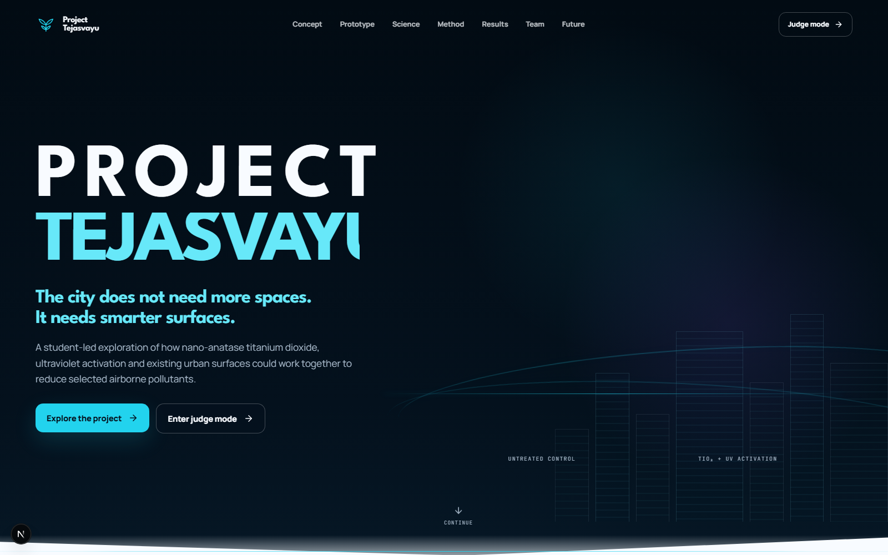
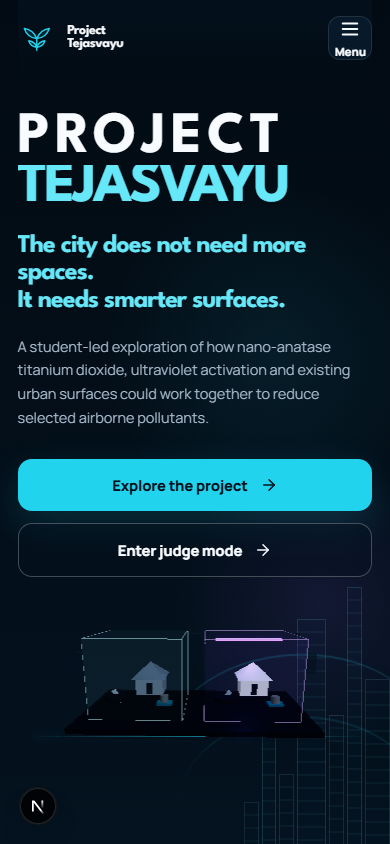
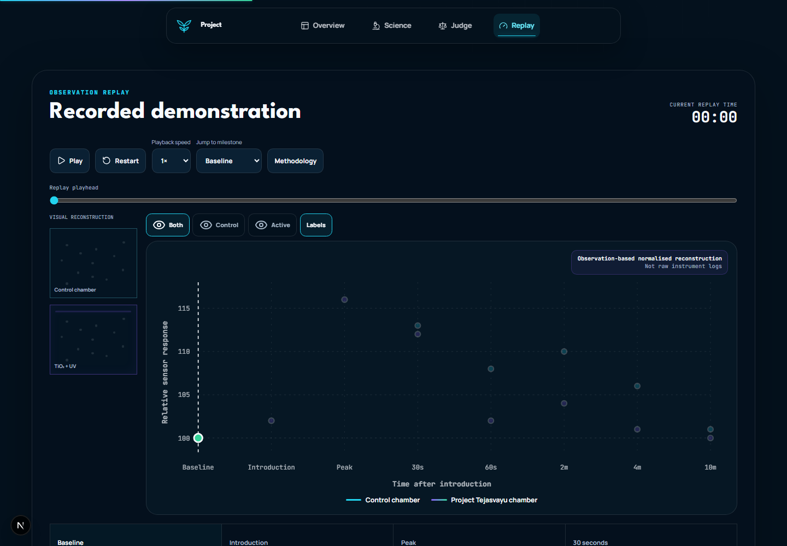

# Project Tejasvayu

The official Version 1 digital identity for Project Tejasvayu: a student-led investigation into how nano-anatase titanium dioxide, suitable ultraviolet activation and existing urban surfaces could support the reduction of selected airborne pollutants.

> **Scientific status:** early-stage educational prototype. The dashboard is a clearly labelled, observation-based normalised reconstruction—not live hardware, raw instrument logs, official AQI or a calibrated pollution measurement.

## Experience

- A cinematic, responsive long-form project story
- A shared motion system with first-visit and repeat-visit pacing, route transitions, section progress and deliberate reduced-motion alternatives
- A code-native interactive two-chamber prototype visual with a non-WebGL fallback
- Scroll-led prototype inspection, construction, science, methodology, results and future chapters with manual controls on touch devices
- Dedicated prototype, science, methodology, results, dashboard, team, future and sources routes
- A seven-chapter keyboard, touch and fullscreen judge presentation
- An accessible recorded-results replay with play, pause, speed, restart and milestone controls
- Typed, dated claim-to-source records and transparent limitations
- Persistent reduced-motion controls, semantic navigation and mobile-first layouts

## Screenshots

| Overview | Mobile | Observation replay |
| --- | --- | --- |
|  |  |  |

## Start locally

Requirements: Node.js 22.14 or newer and npm.

```bash
npm install
npm run dev
```

Open `http://127.0.0.1:3000`.

On Windows PowerShell, use `npm.cmd` if script execution policy blocks `npm.ps1`.

## Quality checks

```bash
npm run lint
npm run typecheck
npm test
npm run build
npx playwright install chromium
npm run test:e2e
```

The browser suite checks every core route, immediate hero interaction, the floating mode dock, judge keyboard and touch flow, replay controls, route-transition accessibility, reduced-motion behaviour, off-screen WebGL pausing, mobile navigation and horizontal overflow.

## Routes

| Route | Purpose |
| --- | --- |
| `/` | Complete narrative overview |
| `/prototype` | Chamber architecture, components, construction and safety |
| `/science` | Photocatalytic mechanism and evidence boundaries |
| `/methodology` | Comparative procedure and variable controls |
| `/results` | Observation milestones, chart and interpretation |
| `/dashboard` | Interactive recorded-results replay |
| `/team` | Student team and responsibilities |
| `/future` | Validation pathway and scale-up vision |
| `/sources` | Typed source registry with supported claims |
| `/judge` | Seven-chapter presentation mode |

## Architecture

Project Tejasvayu is built with Next.js App Router, React, TypeScript, CSS, Motion and React Three Fiber. Project facts, sources and observations live in typed content modules rather than being buried inside page markup.

- [Architecture](docs/ARCHITECTURE.md)
- [Content and source policy](docs/CONTENT-SOURCES.md)
- [Version 2 roadmap](docs/VERSION-2-ROADMAP.md)

Set `NEXT_PUBLIC_SITE_URL` to the canonical production origin before deployment. The site otherwise uses `http://localhost:3000` for generated metadata, the sitemap and robots file.

## Scientific and safety boundaries

- MQ-135 outputs are treated only as relative, cross-sensitive prototype responses without gas-specific calibration.
- Approximate milestones supplied by the project are reconstructed for visual navigation and are never presented as raw measurements.
- The exact UV wavelength has not been verified.
- Results are encouraging observations, not evidence of outdoor removal efficiency or public-health impact.
- UV, electrical loads and test inputs require enclosure, ventilation and adult or teacher supervision.

## Licence

MIT © Satyajit Beura. See [LICENSE](LICENSE).
